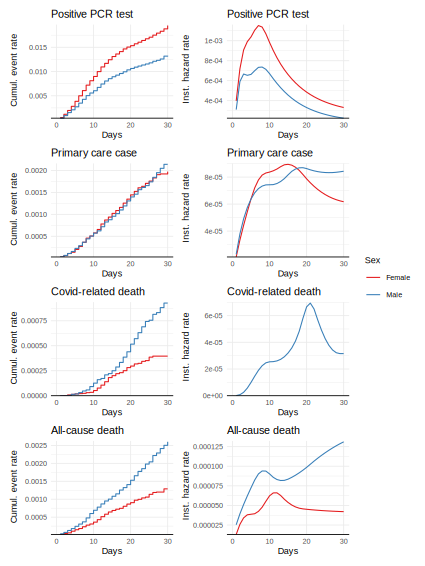
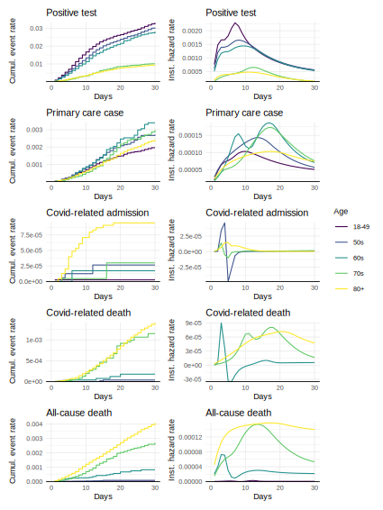
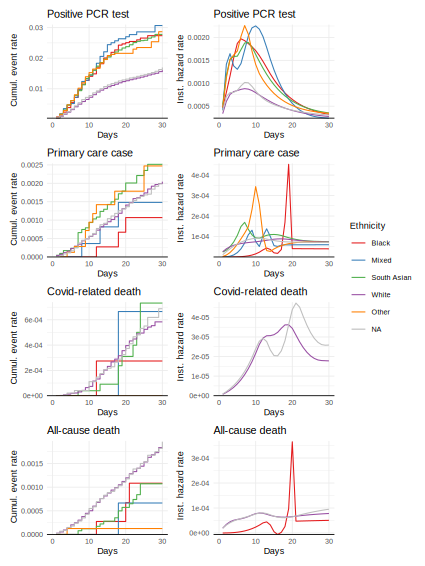
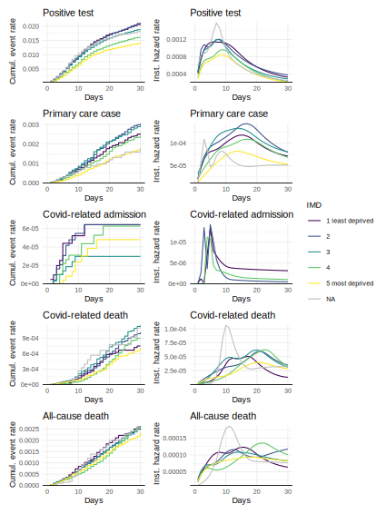
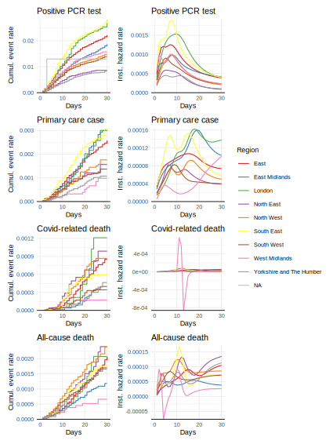

## Vaccine effectiveness data in OpenSAFELY-TPP data

This document reports the frequency of covid-related outcomes in
TPP-registered patients who have received a vaccine for SARS-CoV-2. This
is a technical document to help inform the design of vaccine
effectiveness Studies in OpenSAFELY. Only patients who have received the
vaccine are included, and **no inferences should be made about the
comparative effectiveness between vaccinated and unvaccinated patient,
between vaccine brands, or across different patient groups**.

Measured outcomes include:

-   Positive Covid case identification in primary care, using the
    following clinical codes:
    -   [probable
        covid](https://codelists.opensafely.org/codelist/opensafely/covid-identification-in-primary-care-probable-covid-clinical-code/2020-07-16)
    -   [positive covid
        test](https://codelists.opensafely.org/codelist/opensafely/covid-identification-in-primary-care-probable-covid-positive-test/2020-07-16/)
    -   [covid
        sequelae](https://codelists.opensafely.org/codelist/opensafely/covid-identification-in-primary-care-probable-covid-sequelae/2020-07-16/)
-   Positive SARS-CoV-2 test, as reported via the Second Generation
    Surveillance System (SGSS)
-   Covid-related hospital admission, where
    [Covid](https://codelists.opensafely.org/codelist/opensafely/covid-identification/2020-06-03/)
    is listed as a reason for admission.
-   Covid-related death, where
    [Covid](https://codelists.opensafely.org/codelist/opensafely/covid-identification/2020-06-03/)
    is mentioned anywhere on the death certificate.
-   All-cause death.

### Data notes

The code and data for this report can be found at the
[covid-vaccine-effectiveness-research GitHub
repository](https://github.com/opensafely/covid-vaccine-effectiveness-research).

The dataset used for this report was created using the study definition
`/analysis/study_definition.py`, using codelists referenced in
`/codelists/codelists.txt`. It was extracted from the OpenSAFELY-TPP
data extracted on 2021-01-21, with event dates censored on (occurring no
later than) 2021-01-13.

To minimise data disclosivity in frequency tables, counts are rounded to
the nearest 7 and percentages are derived from these rounded counts.

## Summary

As of 2021-01-13, there were 2590143 TPP-registered patients who had
received at least one vaccine dose. Of these, 0 received the
Pfizer-BioNTech (P-B) vaccine and 0 received the Oxford-AstraZenica
(Ox-AZ) vaccine. Brand is unknown for the remaining 2590143 patients.

## Summaries by patient characteristics

The tables below show, for each characteristic:

-   Vaccine type, including those who have received both vaccine types
-   7-day post-vaccination event rates
-   Cumulative post-vaccination event rates over time
-   Estimated hazard rates over time.

### Sex

<!--html_preserve-->

<table class="gt_table">
<thead class="gt_header">
<tr>
<th colspan="7" class="gt_heading gt_title gt_font_normal" style>
Vaccine type
</th>
</tr>
<tr>
<th colspan="7" class="gt_heading gt_subtitle gt_font_normal gt_bottom_border" style>
</th>
</tr>
</thead>
<thead class="gt_col_headings">
<tr>
<th class="gt_col_heading gt_center gt_columns_bottom_border" rowspan="2" colspan="1">
Sex
</th>
<th class="gt_center gt_columns_top_border gt_column_spanner_outer" rowspan="1" colspan="2">
Ox-AZ
</th>
<th class="gt_center gt_columns_top_border gt_column_spanner_outer" rowspan="1" colspan="2">
P-B
</th>
<th class="gt_center gt_columns_top_border gt_column_spanner_outer" rowspan="1" colspan="2">
Unknown
</th>
</tr>
<tr>
<th class="gt_col_heading gt_columns_bottom_border gt_center" rowspan="1" colspan="1">
n
</th>
<th class="gt_col_heading gt_columns_bottom_border gt_center" rowspan="1" colspan="1">
%
</th>
<th class="gt_col_heading gt_columns_bottom_border gt_center" rowspan="1" colspan="1">
n
</th>
<th class="gt_col_heading gt_columns_bottom_border gt_center" rowspan="1" colspan="1">
%
</th>
<th class="gt_col_heading gt_columns_bottom_border gt_center" rowspan="1" colspan="1">
n
</th>
<th class="gt_col_heading gt_columns_bottom_border gt_center" rowspan="1" colspan="1">
%
</th>
</tr>
</thead>
<tbody class="gt_table_body">
<tr>
<td class="gt_row gt_left">
Female
</td>
<td class="gt_row gt_center">
469938
</td>
<td class="gt_row gt_right">
61.4%
</td>
<td class="gt_row gt_center">
1153866
</td>
<td class="gt_row gt_right">
63.3%
</td>
<td class="gt_row gt_center">
763
</td>
<td class="gt_row gt_right">
65.2%
</td>
</tr>
<tr>
<td class="gt_row gt_left">
Male
</td>
<td class="gt_row gt_center">
295456
</td>
<td class="gt_row gt_right">
38.6%
</td>
<td class="gt_row gt_center">
669704
</td>
<td class="gt_row gt_right">
36.7%
</td>
<td class="gt_row gt_center">
406
</td>
<td class="gt_row gt_right">
34.8%
</td>
</tr>
</tbody>
<tfoot class="gt_sourcenotes">
<tr>
<td class="gt_sourcenote" colspan="7">

-   indicates redacted values
    </td>
    </tr>
    </tfoot>

</table>

<!--/html_preserve-->

   

<!--html_preserve-->

<table class="gt_table">
<thead class="gt_header">
<tr>
<th colspan="12" class="gt_heading gt_title gt_font_normal" style>
Post-vaccination event rates at 14 days amongst those with sufficient
follow-up
</th>
</tr>
<tr>
<th colspan="12" class="gt_heading gt_subtitle gt_font_normal gt_bottom_border" style>
</th>
</tr>
</thead>
<thead class="gt_col_headings">
<tr>
<th class="gt_col_heading gt_center gt_columns_bottom_border" rowspan="2" colspan="1">
Sex
</th>
<th class="gt_col_heading gt_center gt_columns_bottom_border" rowspan="2" colspan="1">
n
</th>
<th class="gt_center gt_columns_top_border gt_column_spanner_outer" rowspan="1" colspan="2">
primary care case
</th>
<th class="gt_center gt_columns_top_border gt_column_spanner_outer" rowspan="1" colspan="2">
positive test
</th>
<th class="gt_center gt_columns_top_border gt_column_spanner_outer" rowspan="1" colspan="2">
covid-related admission
</th>
<th class="gt_center gt_columns_top_border gt_column_spanner_outer" rowspan="1" colspan="2">
covid-related death
</th>
<th class="gt_center gt_columns_top_border gt_column_spanner_outer" rowspan="1" colspan="2">
all-cause death
</th>
</tr>
<tr>
<th class="gt_col_heading gt_columns_bottom_border gt_center" rowspan="1" colspan="1">
n
</th>
<th class="gt_col_heading gt_columns_bottom_border gt_center" rowspan="1" colspan="1">
%
</th>
<th class="gt_col_heading gt_columns_bottom_border gt_center" rowspan="1" colspan="1">
n
</th>
<th class="gt_col_heading gt_columns_bottom_border gt_center" rowspan="1" colspan="1">
%
</th>
<th class="gt_col_heading gt_columns_bottom_border gt_center" rowspan="1" colspan="1">
n
</th>
<th class="gt_col_heading gt_columns_bottom_border gt_center" rowspan="1" colspan="1">
%
</th>
<th class="gt_col_heading gt_columns_bottom_border gt_center" rowspan="1" colspan="1">
n
</th>
<th class="gt_col_heading gt_columns_bottom_border gt_center" rowspan="1" colspan="1">
%
</th>
<th class="gt_col_heading gt_columns_bottom_border gt_center" rowspan="1" colspan="1">
n
</th>
<th class="gt_col_heading gt_columns_bottom_border gt_center" rowspan="1" colspan="1">
%
</th>
</tr>
</thead>
<tbody class="gt_table_body">
<tr>
<td class="gt_row gt_center">
Female
</td>
<td class="gt_row gt_center">
241136
</td>
<td class="gt_row gt_center">
189
</td>
<td class="gt_row gt_right">
0.1%
</td>
<td class="gt_row gt_center">
2408
</td>
<td class="gt_row gt_right">
1.0%
</td>
<td class="gt_row gt_center">
\-
</td>
<td class="gt_row gt_right">
\-
</td>
<td class="gt_row gt_center">
35
</td>
<td class="gt_row gt_right">
0.0%
</td>
<td class="gt_row gt_center">
126
</td>
<td class="gt_row gt_right">
0.1%
</td>
</tr>
<tr>
<td class="gt_row gt_center">
Male
</td>
<td class="gt_row gt_center">
154966
</td>
<td class="gt_row gt_center">
126
</td>
<td class="gt_row gt_right">
0.1%
</td>
<td class="gt_row gt_center">
1022
</td>
<td class="gt_row gt_right">
0.7%
</td>
<td class="gt_row gt_center">
\-
</td>
<td class="gt_row gt_right">
\-
</td>
<td class="gt_row gt_center">
28
</td>
<td class="gt_row gt_right">
0.0%
</td>
<td class="gt_row gt_center">
140
</td>
<td class="gt_row gt_right">
0.1%
</td>
</tr>
</tbody>
<tfoot class="gt_sourcenotes">
<tr>
<td class="gt_sourcenote" colspan="12">
Numbers are rounded to the nearest 7
</td>
</tr>
</tfoot>
</table>

<!--/html_preserve-->

   

### Age

<!--html_preserve-->

<table class="gt_table">
<thead class="gt_header">
<tr>
<th colspan="7" class="gt_heading gt_title gt_font_normal" style>
Vaccine type
</th>
</tr>
<tr>
<th colspan="7" class="gt_heading gt_subtitle gt_font_normal gt_bottom_border" style>
</th>
</tr>
</thead>
<thead class="gt_col_headings">
<tr>
<th class="gt_col_heading gt_center gt_columns_bottom_border" rowspan="2" colspan="1">
Age
</th>
<th class="gt_center gt_columns_top_border gt_column_spanner_outer" rowspan="1" colspan="2">
Ox-AZ
</th>
<th class="gt_center gt_columns_top_border gt_column_spanner_outer" rowspan="1" colspan="2">
P-B
</th>
<th class="gt_center gt_columns_top_border gt_column_spanner_outer" rowspan="1" colspan="2">
Unknown
</th>
</tr>
<tr>
<th class="gt_col_heading gt_columns_bottom_border gt_center" rowspan="1" colspan="1">
n
</th>
<th class="gt_col_heading gt_columns_bottom_border gt_center" rowspan="1" colspan="1">
%
</th>
<th class="gt_col_heading gt_columns_bottom_border gt_center" rowspan="1" colspan="1">
n
</th>
<th class="gt_col_heading gt_columns_bottom_border gt_center" rowspan="1" colspan="1">
%
</th>
<th class="gt_col_heading gt_columns_bottom_border gt_center" rowspan="1" colspan="1">
n
</th>
<th class="gt_col_heading gt_columns_bottom_border gt_center" rowspan="1" colspan="1">
%
</th>
</tr>
</thead>
<tbody class="gt_table_body">
<tr>
<td class="gt_row gt_left">
18-49
</td>
<td class="gt_row gt_center">
115696
</td>
<td class="gt_row gt_right">
15.1%
</td>
<td class="gt_row gt_center">
443149
</td>
<td class="gt_row gt_right">
24.3%
</td>
<td class="gt_row gt_center">
210
</td>
<td class="gt_row gt_right">
18.1%
</td>
</tr>
<tr>
<td class="gt_row gt_left">
50s
</td>
<td class="gt_row gt_center">
60739
</td>
<td class="gt_row gt_right">
7.9%
</td>
<td class="gt_row gt_center">
208376
</td>
<td class="gt_row gt_right">
11.4%
</td>
<td class="gt_row gt_center">
112
</td>
<td class="gt_row gt_right">
9.6%
</td>
</tr>
<tr>
<td class="gt_row gt_left">
60s
</td>
<td class="gt_row gt_center">
54824
</td>
<td class="gt_row gt_right">
7.2%
</td>
<td class="gt_row gt_center">
111790
</td>
<td class="gt_row gt_right">
6.1%
</td>
<td class="gt_row gt_center">
56
</td>
<td class="gt_row gt_right">
4.7%
</td>
</tr>
<tr>
<td class="gt_row gt_left">
70s
</td>
<td class="gt_row gt_center">
331744
</td>
<td class="gt_row gt_right">
43.3%
</td>
<td class="gt_row gt_center">
385042
</td>
<td class="gt_row gt_right">
21.1%
</td>
<td class="gt_row gt_center">
273
</td>
<td class="gt_row gt_right">
23.0%
</td>
</tr>
<tr>
<td class="gt_row gt_left">
80+
</td>
<td class="gt_row gt_center">
202391
</td>
<td class="gt_row gt_right">
26.4%
</td>
<td class="gt_row gt_center">
675213
</td>
<td class="gt_row gt_right">
37.0%
</td>
<td class="gt_row gt_center">
525
</td>
<td class="gt_row gt_right">
44.5%
</td>
</tr>
</tbody>
<tfoot class="gt_sourcenotes">
<tr>
<td class="gt_sourcenote" colspan="7">

-   indicates redacted values
    </td>
    </tr>
    </tfoot>

</table>

<!--/html_preserve-->

   

<!--html_preserve-->

<table class="gt_table">
<thead class="gt_header">
<tr>
<th colspan="12" class="gt_heading gt_title gt_font_normal" style>
Post-vaccination event rates at 14 days amongst those with sufficient
follow-up
</th>
</tr>
<tr>
<th colspan="12" class="gt_heading gt_subtitle gt_font_normal gt_bottom_border" style>
</th>
</tr>
</thead>
<thead class="gt_col_headings">
<tr>
<th class="gt_col_heading gt_center gt_columns_bottom_border" rowspan="2" colspan="1">
Age
</th>
<th class="gt_col_heading gt_center gt_columns_bottom_border" rowspan="2" colspan="1">
n
</th>
<th class="gt_center gt_columns_top_border gt_column_spanner_outer" rowspan="1" colspan="2">
primary care case
</th>
<th class="gt_center gt_columns_top_border gt_column_spanner_outer" rowspan="1" colspan="2">
positive test
</th>
<th class="gt_center gt_columns_top_border gt_column_spanner_outer" rowspan="1" colspan="2">
covid-related admission
</th>
<th class="gt_center gt_columns_top_border gt_column_spanner_outer" rowspan="1" colspan="2">
covid-related death
</th>
<th class="gt_center gt_columns_top_border gt_column_spanner_outer" rowspan="1" colspan="2">
all-cause death
</th>
</tr>
<tr>
<th class="gt_col_heading gt_columns_bottom_border gt_center" rowspan="1" colspan="1">
n
</th>
<th class="gt_col_heading gt_columns_bottom_border gt_center" rowspan="1" colspan="1">
%
</th>
<th class="gt_col_heading gt_columns_bottom_border gt_center" rowspan="1" colspan="1">
n
</th>
<th class="gt_col_heading gt_columns_bottom_border gt_center" rowspan="1" colspan="1">
%
</th>
<th class="gt_col_heading gt_columns_bottom_border gt_center" rowspan="1" colspan="1">
n
</th>
<th class="gt_col_heading gt_columns_bottom_border gt_center" rowspan="1" colspan="1">
%
</th>
<th class="gt_col_heading gt_columns_bottom_border gt_center" rowspan="1" colspan="1">
n
</th>
<th class="gt_col_heading gt_columns_bottom_border gt_center" rowspan="1" colspan="1">
%
</th>
<th class="gt_col_heading gt_columns_bottom_border gt_center" rowspan="1" colspan="1">
n
</th>
<th class="gt_col_heading gt_columns_bottom_border gt_center" rowspan="1" colspan="1">
%
</th>
</tr>
</thead>
<tbody class="gt_table_body">
<tr>
<td class="gt_row gt_center">
18-49
</td>
<td class="gt_row gt_center">
72478
</td>
<td class="gt_row gt_center">
56
</td>
<td class="gt_row gt_right">
0.1%
</td>
<td class="gt_row gt_center">
1456
</td>
<td class="gt_row gt_right">
2.0%
</td>
<td class="gt_row gt_center">
\-
</td>
<td class="gt_row gt_right">
\-
</td>
<td class="gt_row gt_center">
0
</td>
<td class="gt_row gt_right">
0.0%
</td>
<td class="gt_row gt_center">
0
</td>
<td class="gt_row gt_right">
0.0%
</td>
</tr>
<tr>
<td class="gt_row gt_center">
50s
</td>
<td class="gt_row gt_center">
38934
</td>
<td class="gt_row gt_center">
42
</td>
<td class="gt_row gt_right">
0.1%
</td>
<td class="gt_row gt_center">
665
</td>
<td class="gt_row gt_right">
1.7%
</td>
<td class="gt_row gt_center">
\-
</td>
<td class="gt_row gt_right">
\-
</td>
<td class="gt_row gt_center">
0
</td>
<td class="gt_row gt_right">
0.0%
</td>
<td class="gt_row gt_center">
0
</td>
<td class="gt_row gt_right">
0.0%
</td>
</tr>
<tr>
<td class="gt_row gt_center">
60s
</td>
<td class="gt_row gt_center">
17724
</td>
<td class="gt_row gt_center">
14
</td>
<td class="gt_row gt_right">
0.1%
</td>
<td class="gt_row gt_center">
287
</td>
<td class="gt_row gt_right">
1.6%
</td>
<td class="gt_row gt_center">
\-
</td>
<td class="gt_row gt_right">
\-
</td>
<td class="gt_row gt_center">
0
</td>
<td class="gt_row gt_right">
0.0%
</td>
<td class="gt_row gt_center">
7
</td>
<td class="gt_row gt_right">
0.0%
</td>
</tr>
<tr>
<td class="gt_row gt_center">
70s
</td>
<td class="gt_row gt_center">
33061
</td>
<td class="gt_row gt_center">
28
</td>
<td class="gt_row gt_right">
0.1%
</td>
<td class="gt_row gt_center">
189
</td>
<td class="gt_row gt_right">
0.6%
</td>
<td class="gt_row gt_center">
\-
</td>
<td class="gt_row gt_right">
\-
</td>
<td class="gt_row gt_center">
14
</td>
<td class="gt_row gt_right">
0.0%
</td>
<td class="gt_row gt_center">
35
</td>
<td class="gt_row gt_right">
0.1%
</td>
</tr>
<tr>
<td class="gt_row gt_center">
80+
</td>
<td class="gt_row gt_center">
233905
</td>
<td class="gt_row gt_center">
182
</td>
<td class="gt_row gt_right">
0.1%
</td>
<td class="gt_row gt_center">
847
</td>
<td class="gt_row gt_right">
0.4%
</td>
<td class="gt_row gt_center">
\-
</td>
<td class="gt_row gt_right">
\-
</td>
<td class="gt_row gt_center">
49
</td>
<td class="gt_row gt_right">
0.0%
</td>
<td class="gt_row gt_center">
224
</td>
<td class="gt_row gt_right">
0.1%
</td>
</tr>
</tbody>
<tfoot class="gt_sourcenotes">
<tr>
<td class="gt_sourcenote" colspan="12">
Numbers are rounded to the nearest 7
</td>
</tr>
</tfoot>
</table>

<!--/html_preserve-->

   

### Ethnicity

<!--html_preserve-->

<table class="gt_table">
<thead class="gt_header">
<tr>
<th colspan="7" class="gt_heading gt_title gt_font_normal" style>
Vaccine type
</th>
</tr>
<tr>
<th colspan="7" class="gt_heading gt_subtitle gt_font_normal gt_bottom_border" style>
</th>
</tr>
</thead>
<thead class="gt_col_headings">
<tr>
<th class="gt_col_heading gt_center gt_columns_bottom_border" rowspan="2" colspan="1">
Ethnicity
</th>
<th class="gt_center gt_columns_top_border gt_column_spanner_outer" rowspan="1" colspan="2">
Ox-AZ
</th>
<th class="gt_center gt_columns_top_border gt_column_spanner_outer" rowspan="1" colspan="2">
P-B
</th>
<th class="gt_center gt_columns_top_border gt_column_spanner_outer" rowspan="1" colspan="2">
Unknown
</th>
</tr>
<tr>
<th class="gt_col_heading gt_columns_bottom_border gt_center" rowspan="1" colspan="1">
n
</th>
<th class="gt_col_heading gt_columns_bottom_border gt_center" rowspan="1" colspan="1">
%
</th>
<th class="gt_col_heading gt_columns_bottom_border gt_center" rowspan="1" colspan="1">
n
</th>
<th class="gt_col_heading gt_columns_bottom_border gt_center" rowspan="1" colspan="1">
%
</th>
<th class="gt_col_heading gt_columns_bottom_border gt_center" rowspan="1" colspan="1">
n
</th>
<th class="gt_col_heading gt_columns_bottom_border gt_center" rowspan="1" colspan="1">
%
</th>
</tr>
</thead>
<tbody class="gt_table_body">
<tr>
<td class="gt_row gt_left">
Black
</td>
<td class="gt_row gt_center">
8617
</td>
<td class="gt_row gt_right">
1.1%
</td>
<td class="gt_row gt_center">
20643
</td>
<td class="gt_row gt_right">
1.1%
</td>
<td class="gt_row gt_center">
14
</td>
<td class="gt_row gt_right">
1.0%
</td>
</tr>
<tr>
<td class="gt_row gt_left">
Mixed
</td>
<td class="gt_row gt_center">
3402
</td>
<td class="gt_row gt_right">
0.4%
</td>
<td class="gt_row gt_center">
10654
</td>
<td class="gt_row gt_right">
0.6%
</td>
<td class="gt_row gt_center">
14
</td>
<td class="gt_row gt_right">
0.9%
</td>
</tr>
<tr>
<td class="gt_row gt_left">
South Asian
</td>
<td class="gt_row gt_center">
22757
</td>
<td class="gt_row gt_right">
3.0%
</td>
<td class="gt_row gt_center">
79814
</td>
<td class="gt_row gt_right">
4.4%
</td>
<td class="gt_row gt_center">
49
</td>
<td class="gt_row gt_right">
4.1%
</td>
</tr>
<tr>
<td class="gt_row gt_left">
White
</td>
<td class="gt_row gt_center">
546007
</td>
<td class="gt_row gt_right">
71.3%
</td>
<td class="gt_row gt_center">
1257683
</td>
<td class="gt_row gt_right">
69.0%
</td>
<td class="gt_row gt_center">
812
</td>
<td class="gt_row gt_right">
68.9%
</td>
</tr>
<tr>
<td class="gt_row gt_left">
Other
</td>
<td class="gt_row gt_center">
5628
</td>
<td class="gt_row gt_right">
0.7%
</td>
<td class="gt_row gt_center">
17374
</td>
<td class="gt_row gt_right">
1.0%
</td>
<td class="gt_row gt_center">
7
</td>
<td class="gt_row gt_right">
0.9%
</td>
</tr>
<tr>
<td class="gt_row gt_left">
(missing)
</td>
<td class="gt_row gt_center">
178983
</td>
<td class="gt_row gt_right">
23.4%
</td>
<td class="gt_row gt_center">
437402
</td>
<td class="gt_row gt_right">
24.0%
</td>
<td class="gt_row gt_center">
287
</td>
<td class="gt_row gt_right">
24.2%
</td>
</tr>
</tbody>
<tfoot class="gt_sourcenotes">
<tr>
<td class="gt_sourcenote" colspan="7">

-   indicates redacted values
    </td>
    </tr>
    </tfoot>

</table>

<!--/html_preserve-->

   

<!--html_preserve-->

<table class="gt_table">
<thead class="gt_header">
<tr>
<th colspan="12" class="gt_heading gt_title gt_font_normal" style>
Post-vaccination event rates at 14 days amongst those with sufficient
follow-up
</th>
</tr>
<tr>
<th colspan="12" class="gt_heading gt_subtitle gt_font_normal gt_bottom_border" style>
</th>
</tr>
</thead>
<thead class="gt_col_headings">
<tr>
<th class="gt_col_heading gt_center gt_columns_bottom_border" rowspan="2" colspan="1">
Ethnicity
</th>
<th class="gt_col_heading gt_center gt_columns_bottom_border" rowspan="2" colspan="1">
n
</th>
<th class="gt_center gt_columns_top_border gt_column_spanner_outer" rowspan="1" colspan="2">
primary care case
</th>
<th class="gt_center gt_columns_top_border gt_column_spanner_outer" rowspan="1" colspan="2">
positive test
</th>
<th class="gt_center gt_columns_top_border gt_column_spanner_outer" rowspan="1" colspan="2">
covid-related admission
</th>
<th class="gt_center gt_columns_top_border gt_column_spanner_outer" rowspan="1" colspan="2">
covid-related death
</th>
<th class="gt_center gt_columns_top_border gt_column_spanner_outer" rowspan="1" colspan="2">
all-cause death
</th>
</tr>
<tr>
<th class="gt_col_heading gt_columns_bottom_border gt_center" rowspan="1" colspan="1">
n
</th>
<th class="gt_col_heading gt_columns_bottom_border gt_center" rowspan="1" colspan="1">
%
</th>
<th class="gt_col_heading gt_columns_bottom_border gt_center" rowspan="1" colspan="1">
n
</th>
<th class="gt_col_heading gt_columns_bottom_border gt_center" rowspan="1" colspan="1">
%
</th>
<th class="gt_col_heading gt_columns_bottom_border gt_center" rowspan="1" colspan="1">
n
</th>
<th class="gt_col_heading gt_columns_bottom_border gt_center" rowspan="1" colspan="1">
%
</th>
<th class="gt_col_heading gt_columns_bottom_border gt_center" rowspan="1" colspan="1">
n
</th>
<th class="gt_col_heading gt_columns_bottom_border gt_center" rowspan="1" colspan="1">
%
</th>
<th class="gt_col_heading gt_columns_bottom_border gt_center" rowspan="1" colspan="1">
n
</th>
<th class="gt_col_heading gt_columns_bottom_border gt_center" rowspan="1" colspan="1">
%
</th>
</tr>
</thead>
<tbody class="gt_table_body">
<tr>
<td class="gt_row gt_center">
Black
</td>
<td class="gt_row gt_center">
3199
</td>
<td class="gt_row gt_center">
0
</td>
<td class="gt_row gt_right">
0.0%
</td>
<td class="gt_row gt_center">
56
</td>
<td class="gt_row gt_right">
1.7%
</td>
<td class="gt_row gt_center">
\-
</td>
<td class="gt_row gt_right">
\-
</td>
<td class="gt_row gt_center">
0
</td>
<td class="gt_row gt_right">
0.0%
</td>
<td class="gt_row gt_center">
0
</td>
<td class="gt_row gt_right">
0.0%
</td>
</tr>
<tr>
<td class="gt_row gt_center">
Mixed
</td>
<td class="gt_row gt_center">
1967
</td>
<td class="gt_row gt_center">
0
</td>
<td class="gt_row gt_right">
0.1%
</td>
<td class="gt_row gt_center">
28
</td>
<td class="gt_row gt_right">
1.5%
</td>
<td class="gt_row gt_center">
\-
</td>
<td class="gt_row gt_right">
\-
</td>
<td class="gt_row gt_center">
0
</td>
<td class="gt_row gt_right">
0.0%
</td>
<td class="gt_row gt_center">
0
</td>
<td class="gt_row gt_right">
0.0%
</td>
</tr>
<tr>
<td class="gt_row gt_center">
South Asian
</td>
<td class="gt_row gt_center">
17437
</td>
<td class="gt_row gt_center">
21
</td>
<td class="gt_row gt_right">
0.1%
</td>
<td class="gt_row gt_center">
301
</td>
<td class="gt_row gt_right">
1.7%
</td>
<td class="gt_row gt_center">
\-
</td>
<td class="gt_row gt_right">
\-
</td>
<td class="gt_row gt_center">
0
</td>
<td class="gt_row gt_right">
0.0%
</td>
<td class="gt_row gt_center">
7
</td>
<td class="gt_row gt_right">
0.0%
</td>
</tr>
<tr>
<td class="gt_row gt_center">
White
</td>
<td class="gt_row gt_center">
271313
</td>
<td class="gt_row gt_center">
217
</td>
<td class="gt_row gt_right">
0.1%
</td>
<td class="gt_row gt_center">
2177
</td>
<td class="gt_row gt_right">
0.8%
</td>
<td class="gt_row gt_center">
\-
</td>
<td class="gt_row gt_right">
\-
</td>
<td class="gt_row gt_center">
42
</td>
<td class="gt_row gt_right">
0.0%
</td>
<td class="gt_row gt_center">
189
</td>
<td class="gt_row gt_right">
0.1%
</td>
</tr>
<tr>
<td class="gt_row gt_center">
Other
</td>
<td class="gt_row gt_center">
3542
</td>
<td class="gt_row gt_center">
0
</td>
<td class="gt_row gt_right">
0.1%
</td>
<td class="gt_row gt_center">
56
</td>
<td class="gt_row gt_right">
1.5%
</td>
<td class="gt_row gt_center">
\-
</td>
<td class="gt_row gt_right">
\-
</td>
<td class="gt_row gt_center">
0
</td>
<td class="gt_row gt_right">
0.0%
</td>
<td class="gt_row gt_center">
0
</td>
<td class="gt_row gt_right">
0.0%
</td>
</tr>
<tr>
<td class="gt_row gt_center">
(missing)
</td>
<td class="gt_row gt_center">
98644
</td>
<td class="gt_row gt_center">
77
</td>
<td class="gt_row gt_right">
0.1%
</td>
<td class="gt_row gt_center">
826
</td>
<td class="gt_row gt_right">
0.8%
</td>
<td class="gt_row gt_center">
\-
</td>
<td class="gt_row gt_right">
\-
</td>
<td class="gt_row gt_center">
21
</td>
<td class="gt_row gt_right">
0.0%
</td>
<td class="gt_row gt_center">
77
</td>
<td class="gt_row gt_right">
0.1%
</td>
</tr>
</tbody>
<tfoot class="gt_sourcenotes">
<tr>
<td class="gt_sourcenote" colspan="12">
Numbers are rounded to the nearest 7
</td>
</tr>
</tfoot>
</table>

<!--/html_preserve-->

   

### Index of Multiple Deprivation (IMD)

<!--html_preserve-->

<table class="gt_table">
<thead class="gt_header">
<tr>
<th colspan="7" class="gt_heading gt_title gt_font_normal" style>
Vaccine type
</th>
</tr>
<tr>
<th colspan="7" class="gt_heading gt_subtitle gt_font_normal gt_bottom_border" style>
</th>
</tr>
</thead>
<thead class="gt_col_headings">
<tr>
<th class="gt_col_heading gt_center gt_columns_bottom_border" rowspan="2" colspan="1">
IMD
</th>
<th class="gt_center gt_columns_top_border gt_column_spanner_outer" rowspan="1" colspan="2">
Ox-AZ
</th>
<th class="gt_center gt_columns_top_border gt_column_spanner_outer" rowspan="1" colspan="2">
P-B
</th>
<th class="gt_center gt_columns_top_border gt_column_spanner_outer" rowspan="1" colspan="2">
Unknown
</th>
</tr>
<tr>
<th class="gt_col_heading gt_columns_bottom_border gt_center" rowspan="1" colspan="1">
n
</th>
<th class="gt_col_heading gt_columns_bottom_border gt_center" rowspan="1" colspan="1">
%
</th>
<th class="gt_col_heading gt_columns_bottom_border gt_center" rowspan="1" colspan="1">
n
</th>
<th class="gt_col_heading gt_columns_bottom_border gt_center" rowspan="1" colspan="1">
%
</th>
<th class="gt_col_heading gt_columns_bottom_border gt_center" rowspan="1" colspan="1">
n
</th>
<th class="gt_col_heading gt_columns_bottom_border gt_center" rowspan="1" colspan="1">
%
</th>
</tr>
</thead>
<tbody class="gt_table_body">
<tr>
<td class="gt_row gt_left">
1 least deprived
</td>
<td class="gt_row gt_center">
115248
</td>
<td class="gt_row gt_right">
15.1%
</td>
<td class="gt_row gt_center">
246701
</td>
<td class="gt_row gt_right">
13.5%
</td>
<td class="gt_row gt_center">
210
</td>
<td class="gt_row gt_right">
17.8%
</td>
</tr>
<tr>
<td class="gt_row gt_left">
2
</td>
<td class="gt_row gt_center">
134638
</td>
<td class="gt_row gt_right">
17.6%
</td>
<td class="gt_row gt_center">
317653
</td>
<td class="gt_row gt_right">
17.4%
</td>
<td class="gt_row gt_center">
203
</td>
<td class="gt_row gt_right">
17.5%
</td>
</tr>
<tr>
<td class="gt_row gt_left">
3
</td>
<td class="gt_row gt_center">
167776
</td>
<td class="gt_row gt_right">
21.9%
</td>
<td class="gt_row gt_center">
396550
</td>
<td class="gt_row gt_right">
21.7%
</td>
<td class="gt_row gt_center">
210
</td>
<td class="gt_row gt_right">
17.9%
</td>
</tr>
<tr>
<td class="gt_row gt_left">
4
</td>
<td class="gt_row gt_center">
168539
</td>
<td class="gt_row gt_right">
22.0%
</td>
<td class="gt_row gt_center">
414477
</td>
<td class="gt_row gt_right">
22.7%
</td>
<td class="gt_row gt_center">
196
</td>
<td class="gt_row gt_right">
16.4%
</td>
</tr>
<tr>
<td class="gt_row gt_left">
5 most deprived
</td>
<td class="gt_row gt_center">
163821
</td>
<td class="gt_row gt_right">
21.4%
</td>
<td class="gt_row gt_center">
410018
</td>
<td class="gt_row gt_right">
22.5%
</td>
<td class="gt_row gt_center">
259
</td>
<td class="gt_row gt_right">
21.8%
</td>
</tr>
<tr>
<td class="gt_row gt_left">
(missing)
</td>
<td class="gt_row gt_center">
15365
</td>
<td class="gt_row gt_right">
2.0%
</td>
<td class="gt_row gt_center">
38171
</td>
<td class="gt_row gt_right">
2.1%
</td>
<td class="gt_row gt_center">
98
</td>
<td class="gt_row gt_right">
8.5%
</td>
</tr>
</tbody>
<tfoot class="gt_sourcenotes">
<tr>
<td class="gt_sourcenote" colspan="7">

-   indicates redacted values
    </td>
    </tr>
    </tfoot>

</table>

<!--/html_preserve-->

   

<!--html_preserve-->

<table class="gt_table">
<thead class="gt_header">
<tr>
<th colspan="12" class="gt_heading gt_title gt_font_normal" style>
Post-vaccination event rates at 14 days amongst those with sufficient
follow-up
</th>
</tr>
<tr>
<th colspan="12" class="gt_heading gt_subtitle gt_font_normal gt_bottom_border" style>
</th>
</tr>
</thead>
<thead class="gt_col_headings">
<tr>
<th class="gt_col_heading gt_center gt_columns_bottom_border" rowspan="2" colspan="1">
IMD
</th>
<th class="gt_col_heading gt_center gt_columns_bottom_border" rowspan="2" colspan="1">
n
</th>
<th class="gt_center gt_columns_top_border gt_column_spanner_outer" rowspan="1" colspan="2">
primary care case
</th>
<th class="gt_center gt_columns_top_border gt_column_spanner_outer" rowspan="1" colspan="2">
positive test
</th>
<th class="gt_center gt_columns_top_border gt_column_spanner_outer" rowspan="1" colspan="2">
covid-related admission
</th>
<th class="gt_center gt_columns_top_border gt_column_spanner_outer" rowspan="1" colspan="2">
covid-related death
</th>
<th class="gt_center gt_columns_top_border gt_column_spanner_outer" rowspan="1" colspan="2">
all-cause death
</th>
</tr>
<tr>
<th class="gt_col_heading gt_columns_bottom_border gt_center" rowspan="1" colspan="1">
n
</th>
<th class="gt_col_heading gt_columns_bottom_border gt_center" rowspan="1" colspan="1">
%
</th>
<th class="gt_col_heading gt_columns_bottom_border gt_center" rowspan="1" colspan="1">
n
</th>
<th class="gt_col_heading gt_columns_bottom_border gt_center" rowspan="1" colspan="1">
%
</th>
<th class="gt_col_heading gt_columns_bottom_border gt_center" rowspan="1" colspan="1">
n
</th>
<th class="gt_col_heading gt_columns_bottom_border gt_center" rowspan="1" colspan="1">
%
</th>
<th class="gt_col_heading gt_columns_bottom_border gt_center" rowspan="1" colspan="1">
n
</th>
<th class="gt_col_heading gt_columns_bottom_border gt_center" rowspan="1" colspan="1">
%
</th>
<th class="gt_col_heading gt_columns_bottom_border gt_center" rowspan="1" colspan="1">
n
</th>
<th class="gt_col_heading gt_columns_bottom_border gt_center" rowspan="1" colspan="1">
%
</th>
</tr>
</thead>
<tbody class="gt_table_body">
<tr>
<td class="gt_row gt_center">
1 least deprived
</td>
<td class="gt_row gt_center">
54047
</td>
<td class="gt_row gt_center">
42
</td>
<td class="gt_row gt_right">
0.1%
</td>
<td class="gt_row gt_center">
546
</td>
<td class="gt_row gt_right">
1.0%
</td>
<td class="gt_row gt_center">
\-
</td>
<td class="gt_row gt_right">
\-
</td>
<td class="gt_row gt_center">
7
</td>
<td class="gt_row gt_right">
0.0%
</td>
<td class="gt_row gt_center">
42
</td>
<td class="gt_row gt_right">
0.1%
</td>
</tr>
<tr>
<td class="gt_row gt_center">
2
</td>
<td class="gt_row gt_center">
67200
</td>
<td class="gt_row gt_center">
70
</td>
<td class="gt_row gt_right">
0.1%
</td>
<td class="gt_row gt_center">
644
</td>
<td class="gt_row gt_right">
1.0%
</td>
<td class="gt_row gt_center">
\-
</td>
<td class="gt_row gt_right">
\-
</td>
<td class="gt_row gt_center">
14
</td>
<td class="gt_row gt_right">
0.0%
</td>
<td class="gt_row gt_center">
42
</td>
<td class="gt_row gt_right">
0.1%
</td>
</tr>
<tr>
<td class="gt_row gt_center">
3
</td>
<td class="gt_row gt_center">
83419
</td>
<td class="gt_row gt_center">
77
</td>
<td class="gt_row gt_right">
0.1%
</td>
<td class="gt_row gt_center">
763
</td>
<td class="gt_row gt_right">
0.9%
</td>
<td class="gt_row gt_center">
\-
</td>
<td class="gt_row gt_right">
\-
</td>
<td class="gt_row gt_center">
21
</td>
<td class="gt_row gt_right">
0.0%
</td>
<td class="gt_row gt_center">
56
</td>
<td class="gt_row gt_right">
0.1%
</td>
</tr>
<tr>
<td class="gt_row gt_center">
4
</td>
<td class="gt_row gt_center">
90902
</td>
<td class="gt_row gt_center">
77
</td>
<td class="gt_row gt_right">
0.1%
</td>
<td class="gt_row gt_center">
742
</td>
<td class="gt_row gt_right">
0.8%
</td>
<td class="gt_row gt_center">
\-
</td>
<td class="gt_row gt_right">
\-
</td>
<td class="gt_row gt_center">
14
</td>
<td class="gt_row gt_right">
0.0%
</td>
<td class="gt_row gt_center">
49
</td>
<td class="gt_row gt_right">
0.1%
</td>
</tr>
<tr>
<td class="gt_row gt_center">
5 most deprived
</td>
<td class="gt_row gt_center">
91672
</td>
<td class="gt_row gt_center">
49
</td>
<td class="gt_row gt_right">
0.1%
</td>
<td class="gt_row gt_center">
665
</td>
<td class="gt_row gt_right">
0.7%
</td>
<td class="gt_row gt_center">
\-
</td>
<td class="gt_row gt_right">
\-
</td>
<td class="gt_row gt_center">
7
</td>
<td class="gt_row gt_right">
0.0%
</td>
<td class="gt_row gt_center">
63
</td>
<td class="gt_row gt_right">
0.1%
</td>
</tr>
<tr>
<td class="gt_row gt_center">
(missing)
</td>
<td class="gt_row gt_center">
8862
</td>
<td class="gt_row gt_center">
0
</td>
<td class="gt_row gt_right">
0.0%
</td>
<td class="gt_row gt_center">
70
</td>
<td class="gt_row gt_right">
0.8%
</td>
<td class="gt_row gt_center">
\-
</td>
<td class="gt_row gt_right">
\-
</td>
<td class="gt_row gt_center">
0
</td>
<td class="gt_row gt_right">
0.0%
</td>
<td class="gt_row gt_center">
7
</td>
<td class="gt_row gt_right">
0.1%
</td>
</tr>
</tbody>
<tfoot class="gt_sourcenotes">
<tr>
<td class="gt_sourcenote" colspan="12">
Numbers are rounded to the nearest 7
</td>
</tr>
</tfoot>
</table>

<!--/html_preserve-->

   

### Region

<!--html_preserve-->

<table class="gt_table">
<thead class="gt_header">
<tr>
<th colspan="7" class="gt_heading gt_title gt_font_normal" style>
Vaccine type
</th>
</tr>
<tr>
<th colspan="7" class="gt_heading gt_subtitle gt_font_normal gt_bottom_border" style>
</th>
</tr>
</thead>
<thead class="gt_col_headings">
<tr>
<th class="gt_col_heading gt_center gt_columns_bottom_border" rowspan="2" colspan="1">
Region
</th>
<th class="gt_center gt_columns_top_border gt_column_spanner_outer" rowspan="1" colspan="2">
Ox-AZ
</th>
<th class="gt_center gt_columns_top_border gt_column_spanner_outer" rowspan="1" colspan="2">
P-B
</th>
<th class="gt_center gt_columns_top_border gt_column_spanner_outer" rowspan="1" colspan="2">
Unknown
</th>
</tr>
<tr>
<th class="gt_col_heading gt_columns_bottom_border gt_center" rowspan="1" colspan="1">
n
</th>
<th class="gt_col_heading gt_columns_bottom_border gt_center" rowspan="1" colspan="1">
%
</th>
<th class="gt_col_heading gt_columns_bottom_border gt_center" rowspan="1" colspan="1">
n
</th>
<th class="gt_col_heading gt_columns_bottom_border gt_center" rowspan="1" colspan="1">
%
</th>
<th class="gt_col_heading gt_columns_bottom_border gt_center" rowspan="1" colspan="1">
n
</th>
<th class="gt_col_heading gt_columns_bottom_border gt_center" rowspan="1" colspan="1">
%
</th>
</tr>
</thead>
<tbody class="gt_table_body">
<tr>
<td class="gt_row gt_left">
East
</td>
<td class="gt_row gt_center">
165186
</td>
<td class="gt_row gt_right">
21.6%
</td>
<td class="gt_row gt_center">
459886
</td>
<td class="gt_row gt_right">
25.2%
</td>
<td class="gt_row gt_center">
224
</td>
<td class="gt_row gt_right">
19.3%
</td>
</tr>
<tr>
<td class="gt_row gt_left">
East Midlands
</td>
<td class="gt_row gt_center">
117817
</td>
<td class="gt_row gt_right">
15.4%
</td>
<td class="gt_row gt_center">
302519
</td>
<td class="gt_row gt_right">
16.6%
</td>
<td class="gt_row gt_center">
378
</td>
<td class="gt_row gt_right">
32.2%
</td>
</tr>
<tr>
<td class="gt_row gt_left">
London
</td>
<td class="gt_row gt_center">
29862
</td>
<td class="gt_row gt_right">
3.9%
</td>
<td class="gt_row gt_center">
76034
</td>
<td class="gt_row gt_right">
4.2%
</td>
<td class="gt_row gt_center">
35
</td>
<td class="gt_row gt_right">
2.9%
</td>
</tr>
<tr>
<td class="gt_row gt_left">
North East
</td>
<td class="gt_row gt_center">
32984
</td>
<td class="gt_row gt_right">
4.3%
</td>
<td class="gt_row gt_center">
86093
</td>
<td class="gt_row gt_right">
4.7%
</td>
<td class="gt_row gt_center">
21
</td>
<td class="gt_row gt_right">
2.0%
</td>
</tr>
<tr>
<td class="gt_row gt_left">
North West
</td>
<td class="gt_row gt_center">
77658
</td>
<td class="gt_row gt_right">
10.1%
</td>
<td class="gt_row gt_center">
167881
</td>
<td class="gt_row gt_right">
9.2%
</td>
<td class="gt_row gt_center">
203
</td>
<td class="gt_row gt_right">
17.4%
</td>
</tr>
<tr>
<td class="gt_row gt_left">
South East
</td>
<td class="gt_row gt_center">
54159
</td>
<td class="gt_row gt_right">
7.1%
</td>
<td class="gt_row gt_center">
131026
</td>
<td class="gt_row gt_right">
7.2%
</td>
<td class="gt_row gt_center">
77
</td>
<td class="gt_row gt_right">
6.3%
</td>
</tr>
<tr>
<td class="gt_row gt_left">
South West
</td>
<td class="gt_row gt_center">
118342
</td>
<td class="gt_row gt_right">
15.5%
</td>
<td class="gt_row gt_center">
297045
</td>
<td class="gt_row gt_right">
16.3%
</td>
<td class="gt_row gt_center">
70
</td>
<td class="gt_row gt_right">
6.1%
</td>
</tr>
<tr>
<td class="gt_row gt_left">
West Midlands
</td>
<td class="gt_row gt_center">
34832
</td>
<td class="gt_row gt_right">
4.6%
</td>
<td class="gt_row gt_center">
65660
</td>
<td class="gt_row gt_right">
3.6%
</td>
<td class="gt_row gt_center">
35
</td>
<td class="gt_row gt_right">
2.8%
</td>
</tr>
<tr>
<td class="gt_row gt_left">
Yorkshire and The Humber
</td>
<td class="gt_row gt_center">
134484
</td>
<td class="gt_row gt_right">
17.6%
</td>
<td class="gt_row gt_center">
237209
</td>
<td class="gt_row gt_right">
13.0%
</td>
<td class="gt_row gt_center">
126
</td>
<td class="gt_row gt_right">
10.9%
</td>
</tr>
<tr>
<td class="gt_row gt_left">
(missing)
</td>
<td class="gt_row gt_center">
70
</td>
<td class="gt_row gt_right">
0.0%
</td>
<td class="gt_row gt_center">
224
</td>
<td class="gt_row gt_right">
0.0%
</td>
<td class="gt_row gt_center">
0
</td>
<td class="gt_row gt_right">
0.0%
</td>
</tr>
</tbody>
<tfoot class="gt_sourcenotes">
<tr>
<td class="gt_sourcenote" colspan="7">

-   indicates redacted values
    </td>
    </tr>
    </tfoot>

</table>

<!--/html_preserve-->

   

<!--html_preserve-->

<table class="gt_table">
<thead class="gt_header">
<tr>
<th colspan="12" class="gt_heading gt_title gt_font_normal" style>
Post-vaccination event rates at 14 days amongst those with sufficient
follow-up
</th>
</tr>
<tr>
<th colspan="12" class="gt_heading gt_subtitle gt_font_normal gt_bottom_border" style>
</th>
</tr>
</thead>
<thead class="gt_col_headings">
<tr>
<th class="gt_col_heading gt_center gt_columns_bottom_border" rowspan="2" colspan="1">
Region
</th>
<th class="gt_col_heading gt_center gt_columns_bottom_border" rowspan="2" colspan="1">
n
</th>
<th class="gt_center gt_columns_top_border gt_column_spanner_outer" rowspan="1" colspan="2">
primary care case
</th>
<th class="gt_center gt_columns_top_border gt_column_spanner_outer" rowspan="1" colspan="2">
positive test
</th>
<th class="gt_center gt_columns_top_border gt_column_spanner_outer" rowspan="1" colspan="2">
covid-related admission
</th>
<th class="gt_center gt_columns_top_border gt_column_spanner_outer" rowspan="1" colspan="2">
covid-related death
</th>
<th class="gt_center gt_columns_top_border gt_column_spanner_outer" rowspan="1" colspan="2">
all-cause death
</th>
</tr>
<tr>
<th class="gt_col_heading gt_columns_bottom_border gt_center" rowspan="1" colspan="1">
n
</th>
<th class="gt_col_heading gt_columns_bottom_border gt_center" rowspan="1" colspan="1">
%
</th>
<th class="gt_col_heading gt_columns_bottom_border gt_center" rowspan="1" colspan="1">
n
</th>
<th class="gt_col_heading gt_columns_bottom_border gt_center" rowspan="1" colspan="1">
%
</th>
<th class="gt_col_heading gt_columns_bottom_border gt_center" rowspan="1" colspan="1">
n
</th>
<th class="gt_col_heading gt_columns_bottom_border gt_center" rowspan="1" colspan="1">
%
</th>
<th class="gt_col_heading gt_columns_bottom_border gt_center" rowspan="1" colspan="1">
n
</th>
<th class="gt_col_heading gt_columns_bottom_border gt_center" rowspan="1" colspan="1">
%
</th>
<th class="gt_col_heading gt_columns_bottom_border gt_center" rowspan="1" colspan="1">
n
</th>
<th class="gt_col_heading gt_columns_bottom_border gt_center" rowspan="1" colspan="1">
%
</th>
</tr>
</thead>
<tbody class="gt_table_body">
<tr>
<td class="gt_row gt_center">
East
</td>
<td class="gt_row gt_center">
83531
</td>
<td class="gt_row gt_center">
84
</td>
<td class="gt_row gt_right">
0.1%
</td>
<td class="gt_row gt_center">
882
</td>
<td class="gt_row gt_right">
1.1%
</td>
<td class="gt_row gt_center">
\-
</td>
<td class="gt_row gt_right">
\-
</td>
<td class="gt_row gt_center">
14
</td>
<td class="gt_row gt_right">
0.0%
</td>
<td class="gt_row gt_center">
42
</td>
<td class="gt_row gt_right">
0.1%
</td>
</tr>
<tr>
<td class="gt_row gt_center">
East Midlands
</td>
<td class="gt_row gt_center">
58366
</td>
<td class="gt_row gt_center">
56
</td>
<td class="gt_row gt_right">
0.1%
</td>
<td class="gt_row gt_center">
560
</td>
<td class="gt_row gt_right">
1.0%
</td>
<td class="gt_row gt_center">
\-
</td>
<td class="gt_row gt_right">
\-
</td>
<td class="gt_row gt_center">
0
</td>
<td class="gt_row gt_right">
0.0%
</td>
<td class="gt_row gt_center">
28
</td>
<td class="gt_row gt_right">
0.0%
</td>
</tr>
<tr>
<td class="gt_row gt_center">
London
</td>
<td class="gt_row gt_center">
12481
</td>
<td class="gt_row gt_center">
14
</td>
<td class="gt_row gt_right">
0.1%
</td>
<td class="gt_row gt_center">
203
</td>
<td class="gt_row gt_right">
1.6%
</td>
<td class="gt_row gt_center">
\-
</td>
<td class="gt_row gt_right">
\-
</td>
<td class="gt_row gt_center">
0
</td>
<td class="gt_row gt_right">
0.0%
</td>
<td class="gt_row gt_center">
7
</td>
<td class="gt_row gt_right">
0.0%
</td>
</tr>
<tr>
<td class="gt_row gt_center">
North East
</td>
<td class="gt_row gt_center">
18543
</td>
<td class="gt_row gt_center">
14
</td>
<td class="gt_row gt_right">
0.1%
</td>
<td class="gt_row gt_center">
119
</td>
<td class="gt_row gt_right">
0.6%
</td>
<td class="gt_row gt_center">
\-
</td>
<td class="gt_row gt_right">
\-
</td>
<td class="gt_row gt_center">
14
</td>
<td class="gt_row gt_right">
0.1%
</td>
<td class="gt_row gt_center">
21
</td>
<td class="gt_row gt_right">
0.1%
</td>
</tr>
<tr>
<td class="gt_row gt_center">
North West
</td>
<td class="gt_row gt_center">
45927
</td>
<td class="gt_row gt_center">
35
</td>
<td class="gt_row gt_right">
0.1%
</td>
<td class="gt_row gt_center">
357
</td>
<td class="gt_row gt_right">
0.8%
</td>
<td class="gt_row gt_center">
\-
</td>
<td class="gt_row gt_right">
\-
</td>
<td class="gt_row gt_center">
7
</td>
<td class="gt_row gt_right">
0.0%
</td>
<td class="gt_row gt_center">
42
</td>
<td class="gt_row gt_right">
0.1%
</td>
</tr>
<tr>
<td class="gt_row gt_center">
South East
</td>
<td class="gt_row gt_center">
30394
</td>
<td class="gt_row gt_center">
42
</td>
<td class="gt_row gt_right">
0.1%
</td>
<td class="gt_row gt_center">
427
</td>
<td class="gt_row gt_right">
1.4%
</td>
<td class="gt_row gt_center">
\-
</td>
<td class="gt_row gt_right">
\-
</td>
<td class="gt_row gt_center">
7
</td>
<td class="gt_row gt_right">
0.0%
</td>
<td class="gt_row gt_center">
28
</td>
<td class="gt_row gt_right">
0.1%
</td>
</tr>
<tr>
<td class="gt_row gt_center">
South West
</td>
<td class="gt_row gt_center">
67606
</td>
<td class="gt_row gt_center">
42
</td>
<td class="gt_row gt_right">
0.1%
</td>
<td class="gt_row gt_center">
476
</td>
<td class="gt_row gt_right">
0.7%
</td>
<td class="gt_row gt_center">
\-
</td>
<td class="gt_row gt_right">
\-
</td>
<td class="gt_row gt_center">
7
</td>
<td class="gt_row gt_right">
0.0%
</td>
<td class="gt_row gt_center">
49
</td>
<td class="gt_row gt_right">
0.1%
</td>
</tr>
<tr>
<td class="gt_row gt_center">
West Midlands
</td>
<td class="gt_row gt_center">
17276
</td>
<td class="gt_row gt_center">
0
</td>
<td class="gt_row gt_right">
0.0%
</td>
<td class="gt_row gt_center">
154
</td>
<td class="gt_row gt_right">
0.9%
</td>
<td class="gt_row gt_center">
\-
</td>
<td class="gt_row gt_right">
\-
</td>
<td class="gt_row gt_center">
0
</td>
<td class="gt_row gt_right">
0.0%
</td>
<td class="gt_row gt_center">
7
</td>
<td class="gt_row gt_right">
0.0%
</td>
</tr>
<tr>
<td class="gt_row gt_center">
Yorkshire and The Humber
</td>
<td class="gt_row gt_center">
61950
</td>
<td class="gt_row gt_center">
28
</td>
<td class="gt_row gt_right">
0.0%
</td>
<td class="gt_row gt_center">
259
</td>
<td class="gt_row gt_right">
0.4%
</td>
<td class="gt_row gt_center">
\-
</td>
<td class="gt_row gt_right">
\-
</td>
<td class="gt_row gt_center">
7
</td>
<td class="gt_row gt_right">
0.0%
</td>
<td class="gt_row gt_center">
49
</td>
<td class="gt_row gt_right">
0.1%
</td>
</tr>
<tr>
<td class="gt_row gt_center">
(missing)
</td>
<td class="gt_row gt_center">
35
</td>
<td class="gt_row gt_center">
0
</td>
<td class="gt_row gt_right">
0.0%
</td>
<td class="gt_row gt_center">
0
</td>
<td class="gt_row gt_right">
0.0%
</td>
<td class="gt_row gt_center">
\-
</td>
<td class="gt_row gt_right">
\-
</td>
<td class="gt_row gt_center">
0
</td>
<td class="gt_row gt_right">
0.0%
</td>
<td class="gt_row gt_center">
0
</td>
<td class="gt_row gt_right">
0.0%
</td>
</tr>
</tbody>
<tfoot class="gt_sourcenotes">
<tr>
<td class="gt_sourcenote" colspan="12">
Numbers are rounded to the nearest 7
</td>
</tr>
</tfoot>
</table>

<!--/html_preserve-->

   

